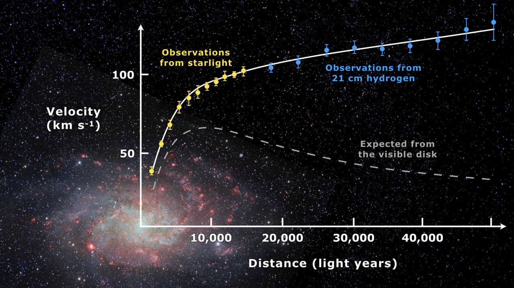
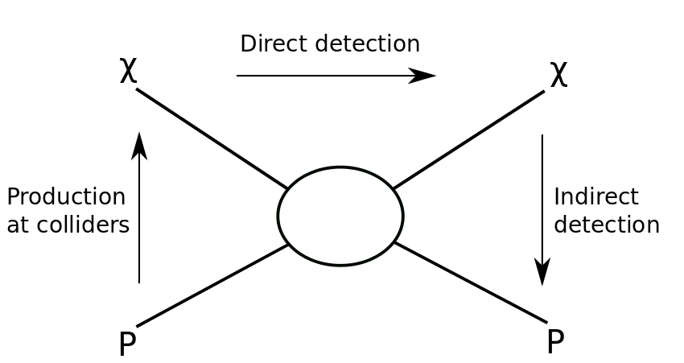
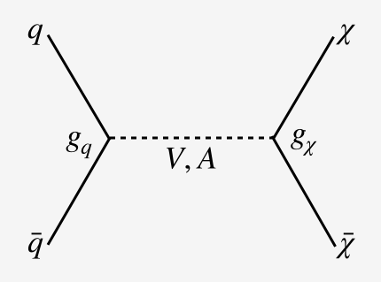

More than a quarter of the energy density of our Universe consists of Dark Matter (DM).
We know DM has gravitational interactions, hence the name "matter", and it is not visible
like stars in a galaxy, hence the name "dark". Our only observations of DM so far comes
from its gravitational interactions, \emph{eg} providing extra gravitational force in a
galaxy such that the stars away from the galactic center rotate faster than expected
from only visible matter.

> ## Go Read for Yourself
>
> This introduction is far too brief but one of the most comprehensive reviews is from 2004 - [hep-ph/0404175](https://arxiv.org/abs/hep-ph/0404175).
> The fact that it is from 2004 and still is entirely relevant 15 years later gives you a strong sense of where our
> understanding as a community is concerning DM.  Although we are probing more broadly and deeper
> with all experiments, the fundamentals remain unchanged.
>
{: .callout}

There are theoretical motivations to believe that DM is a new (elementary or composite)
particle and interacts with the SM, albeit weakly. DM could be a Dirac or Majorana fermion
or a scalar particle. It can have various types of interactions with the SM, for example
through the exchange of new massive gauge bosons. The conventional wisdom has been that
DM relic density is set by its annihilation into SM particles via weak-scale interactions.
These type of DM models are generically called WIMPs, for Weakly Interacting Massive Particles,
and have served as the paradigm for DM searches at the LHC since Run 1.

## The Three-fold Way

There are three main ways to detect possible DM interactions with SM particles.

- **[1] - Direct Detection** : DM can scatter off of SM particles. We expect to see these scattering
processes "directly" when they recoil from samples of material that are placedin very controlled, low-background
environments.  Experiments such as these are [LUX](http://luxdarkmatter.org/) or [Xenon-1T](http://www.xenon1t.org/).
- **[2] - Indirect Detection** : In environments like the center of the galaxy, where the density of DM is high,
DM particles can annihilate to SM particles. Astrophysical observations could detect the SM particles
(e.g. photons or positrons) produced by DM. This is called "indirect detection" because we only observe
the final products and not the DM itself. Two very well-known indirect detection experiments are [Fermi
LAT](https://glast.sites.stanford.edu/) and [AMS](http://ams.cern.ch/).
- **[3] - Production/Collider** : The final means by which we probe DM is through its production at colliders.
If you have already accepted [1] then you should be comfortable enough to simply reverse the process
and cross your fingers that when we collide SM particles, some amount of the time we will "produce" DM,
hence the nomenclature "production".
At the moment, the biggest players in the game at the LHC are [ATLAS](http://atlasexperiment.org/) and [CMS](https://home.cern/science/experiments/cms), but B-factories
like [Belle-II]() will provide very complementary perspectives.

## Our "Benchmark" Model

The DM model we will focus on contains Dirac fermion DM particles coupled to the SM via a
gauge mediator. The mediator can be either a vector or an axial vector, as in the weak
interactions of the SM.   This simplified model has 4(-ish) parameters

- Mediator mass : m(V)
- Dark matter mass : m(DM)
- Coupling between DM and the mediator : g(DM)
- Coupling between DM and the mediator : g(SM) - this is where the "-ish" gets introduced and where you
can first become most acutely aware of the rather extreme model dependence of the statements.  There are many SM particles
that the mediator can possibly couple to (e.g. quarks vs. leptons) and though we often boil this down into one
coupling constant, you must be aware of the assumptions this implies.

At the LHC, if produced, DM would contribute to the missing transverse energy (Ahhhhh, but don't call it energy
if you are a hardcore experimentalist ... more later.) because it
does not decay and is does not interact with the detectors. Well, at least, when the reconstruction is performed we
assume that it does not ... which is a good assumption given that people spend their whole lives looking
for a single interaction in a specially designed detector with low noise (i.e. direct detection).  Therefore, one
experimental handle the we can use to be sensitive to something we can't see is to consider signatures with a radiated gluon from
the initial state, which will form a hadronic jet. These are called monojet searches.  They are not new and have
been performed since LEP and SPS but they are so "bread and butter" for a DM enthusiast that they are what we will focus on
in this tutorial. (Don't worry, much more on how one of these is done will come later.)

## The LHC Dark Matter Working Group

In this tutorial, we will be presenting a very biased perspective, focusing on the "Production/Collider"
side of things, particularly that of the LHC.  To give you some of the history of how we view this at the
LHC, there is a dedicated working group called the [LHC-Dark Matter Working Group](https://lpcc.web.cern.ch/content/lhc-dm-wg-wg-dark-matter-searches-lhc) that provides a context
to ensure broad coverage of both theorists and experimentalists interested in this topic.  If you are not
on the mailing list, feel free to join!  And it is thanks to this group which organized a comprehensive
study during the first long shutdown of the LHC ([1507.00966](http://arxiv.org/abs/1507.00966)) that aimed to standardize the models
that are probed.  This helped to simplify the discussions and ensure that we were all talking
the same language, which is that of "simplified models".  These are models which we admit are
probably too simple for nature to realize "in reality", but give us a concrete forum by which to
benchmark the sensitivity of our searches and identify and "holes" in our coverage.  One of the
initial outcomes of this work was precisely the vector-mediator and axial-vector-mediator models
discussed above, which have served as one of the primary benchmarks since the beginning of Run 2.

After becoming comfortable with this, the same group set about to solidify more concretely just
_how_ these results can and _should_ be presented.  The reasoning here is that since there are three
broad communities of physicists probing DM, and the probes at the LHC are some of the most model
specific, how can we present our results with a clean conscience.  This resulted in a very nice
work ([1603.04156](https://arxiv.org/abs/1603.04156)) that clarifies the relevance of things like "How seriously should I take
that 'relic abundance' exclusion?".  At the same time, a considerable effort was sunk into improving
our understanding of the dominant SM backgrounds to these searches as well as the associated
uncertainties on these backgrounds, resulting in precision recommendations for V+jets predictions ([1705.04664](https://arxiv.org/abs/1705.04664)).

However, with a lack of clear evidence for a positive signal of DM at the LHC from the beginning
of Run 2, the next step was to understand if this is because we weren't "looking in the right places".
This lead us from the simple (axial-)vector-mediator model to the "2HDM+a model" ([1810.09420](https://arxiv.org/abs/1810.09420))
which introduces a few new particles and couplings and therefore opens up the possibility for
more exotic signatures.  Perhaps the ability to produce DM via SM couplings is being muddied by
looking at signal regions that are too "inclusive", perhaps we must focus on a specific corner of phase
space to see the signal pop up.

Finally, and most recently, this group has begun to focus on what are called "t-channel models"
in which there is no resonant s-channel degree of freedom as before, but there are couplings that
cause for transitions from SM to DM via a mediator emission.  This is ongoing work within the
group and with the tools that you learn in this workshop, you will already be in a place to
contribute! COOL!

> ## SUSY has DM
>
> Although it may seem so obvious to some, it should not go without saying that supersymmetry
> has **always** provided a means by which to describe DM in the form of the "lightest supersymmetric particles" (LSP).
> This is nothing new and the LHC experiments have dedicated groups searching for SUSY.  However,
> you may sometimes find that the focus at this workshop will trend in the direction of simplified
> models or "generic signatures".  But don't forget SUSY ... "it's just around the corner!
>
{: .callout}



