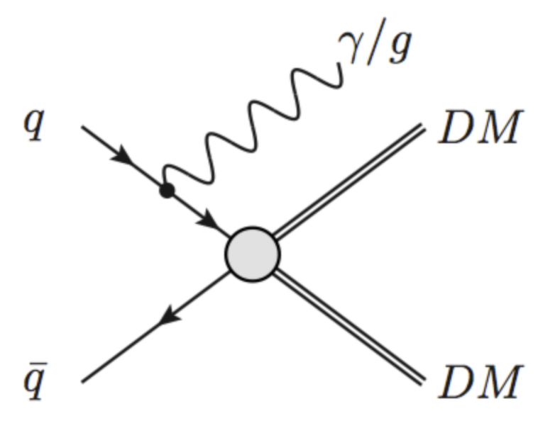
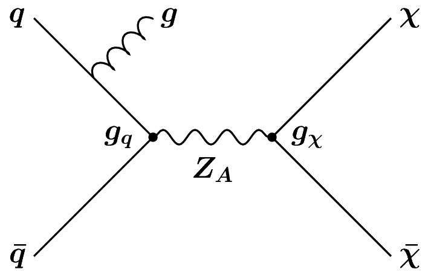
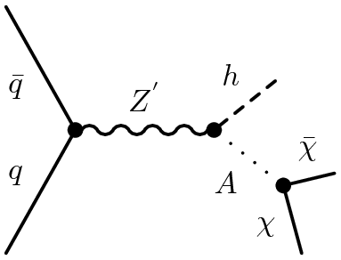
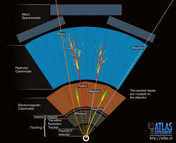
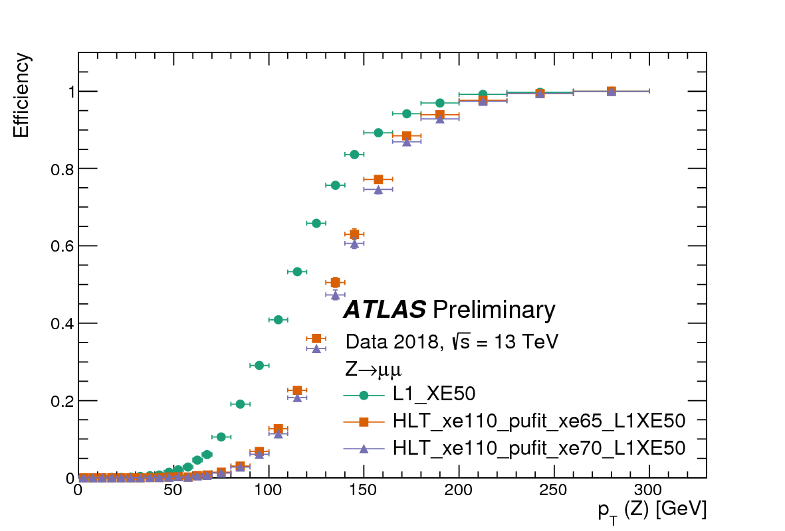

## Observing Dark Matter

When considering dark matter (DM) in the context of the LHC, it is important to acknowledge that
we **do not know** if it is a fundamental particle.  However, if we assume it to be
then it is possible to imagine a theory with a set of symmetries, which give rise to a particular Lagrangian
in which there is an interaction between Standard Model (SM) particles and DM.  This theory
can be either an effective field theory (left) or a complete theory (right), but in both cases
what we are focusing on at the LHC is that we can collide SM particles, and what comes out
is DM particles.

The tricky part here, is that we already know that DM particles (assuming they are particles)
interact very weakly with ordinary matter, or we would have already seen them.  As such,
the DM particles that are produced if such an interaction occurs, will pass through an LHC
detector unimpeded by the tracking detectors, the calorimeters, or the muon systems. For all
intents and purposes, they are "invisible".  From an experimental point of view, this poses
two issues, which are related.

**[1] Trigger** : If there is nothing that interacts in your detector, then there is no way that the hardware
and software can know to issue a **trigger** signal and subsequently read out the data.  You
don't record anything!

**[2] Reconstruction** : If the particle that you want to study does not interact with the
detector that is supposed to "see" it, then you cannot reconstruct and (directly) observe
its properties, as opposed to an electron which leaves a very unique signal in the tracker
and calorimeter systems.

To circumvent these issues, what most searches for DM rely on is the presence of an "associated"
particle that is produced in addition to the DM.  This particle may be coming from
and initial state radiation of a gluon (left) or something more complex, like a Higgs boson
or a top quark that is produced "internally" in the diagram (center, right).  When these
particles (or more accurately their decay products) enter the detector, they leave a distinct
"signature" in the ensemble of detector subsystems.  This signature allows us to make a positive
decision to trigger on an event and record the data for offline analysis.

However, we are still left with problem [2], we cannot examine the properties of the DM particles
produced because they are invisible.  For this, we can rely on basic conservation of momentum
to **infer** the presence of DM because the partons that are incoming to the collision themselves
approximately have a combined momentum in the plane **transverse** to the beamline (z-axis)
of zero.  And, since the detectors that we reconstruct are "hermetic", meaning that they span
nearly the full 4-pi solid angle surrounding the interaction point, we can observe all of the
outgoing particles ... so long as they are visible.  Now, if all of the particles produced in
an event are visible, then the final net momentum in the transverse plane of these particles should be the same
as the initial net momentum in the transverse plane of the incoming two partons, and therefore
zero.  But if some of the particles in the event are invisible, then adding the observed momenta
of only the visible particles will not necessarily sum to zero and we will observe a net **imbalance**
in the final transverse momentum in the event.  It is this net imbalance in momentum, called **"missing transverse momentum"**,
which allows us to infer that something invisible was produced, and which may be dark matter.

> ## A Pedantic (but important) Rant
> This is *not* called "missing energy", and don't let someone convince you it is called that
> and don't start calling it that yourself.  Energy is a scalar quantity, momentum is a vector.
> And since we care about an **imbalance**, we have to care about the directionality in the sum.
> Therefore, this observable quantity should always be called the **MISSING TRANSVERSE MOMENTUM**!
>
{: .callout}

## The Ingredients of a Search

Most of the searches that occur at the LHC can be characterized as "signature based searches" meaning that
the selection criteria which defines the set of events under study, and therefore the "fiducial phase space"
for which you are measuring the event rate, are based on a conceptual understanding of the unique topology.
For dark matter searches, one of these criteria is that we are interested in those events with a large
momentum imbalance and can additionally study the presence of other final state particles that may give hints
as to interesting features of the DM-SM interaction.  After defining this phase space, we must estimate the
background (i.e. contribution from "uninteresting" SM processes) as well as quantifying the uncertainties on this
estimate as well as the estimate of the purported signal.  Finally, our understanding of the observed physics
is tied to the parameters of the new physics via a statistical tool called the likelihood.

Fully understanding the details of each of these parts is out of the scope of this tutorial,
but we highlight here some of the more salient points.

## Identifying the Signature

Identifying a signature can start at 0th order from a simple examination of the Feynman diagrams that our BSM
physics signal can produce.  If we take the example of producing the Z' diagram above, then the signature
of our signal is (1) a single gluon [emitted as ISR] and (2) large momentum imbalance [because of the
invisible DM particles]. So we want to **"select""** events with these two things.  The next step is to consider the types of processes that occur in the SM and
how they differ from the features in our BSM physics.  In this case, there are two and only two things which our
desired sets of events have {a gluon, high momentum imbalance}.  There should not be photons and there should
not be electrons/muons/taus.  And this highlights the second aspect of a signature, a **"veto"**, whereby we
reject events which contain these types of particles.

So, the goal when defining a signature is to find the minimal set of features that you need to positively identify
an event as probably coming from your diagram of interest as well as the set of features that it definitely
_doesn't_ have, which can be used to reject "boring" SM events.

## From Particles to Physics Objects

Now, the diagrams we are studying when we are at **parton level** meaning that they are
not actually representative of the observable and reconstructed signals in the event, and for this we must rather
understand the concept of a "physics object" which relates a short distance degree of freedom (a particle)
to an experimental observable in the set of detector subsystems.  Once this abstraction is made,
the terms are often used interchangeably.

### Leptons (electrons and muons)

When an experimental physicist says "leptons" in the context of the LHC, they are often referring only
to charged leptons, which are easy to identify.  This is because neutrinos, like DM, are weakly interacting
and more often than not will pass through the detector unimpeded.  Moreover, they will often only refer to
the first two generations (electrons and muons) because these are very cleanly reconstructed signals, as compared to
tau leptons.

**Electrons** : Electrons are charged particles, so they will leave a track in the inner tracking detector (ID).
Moreover, they will produce an energetic shower in the electromagnetic calorimeter with little energy
appearing in the hadronic calorimeter behind.  Therefore, an electron can be identified by finding a track in
the ID which points to a shower in the ECal.

**Muons** : A muon is a charged particle as well, so like an electron it will leave a a track in the ID.  However,
for the energies that muons typically have at the LHC it is a minimum ionizing particle and therefore deposits
a minimal amount of energy in the calorimeter systems and will pass through largely unimpeded.  Therefore, outside
the calorimeters, another set of larger "tracking detectors" (the MS=muon spectrometer) is placed to detect the
passing of the muon.  Because nearly all other particles are stopped by the calorimeters, by finding a positive match
between an ID track and an MS track, we can reconstruct a muon.

### Photons

A photon interacts electromagnetically, like an electron, and so it will show up in the ECal as an energetic shower.
However, because it is neutral, it will not leave a trace in the ID.  Therefore, a photon can be identified as a
collimated cluster of energy in the ECal to which no ID track is associated.  A challenging aspect of photon identification
is to distinguish photons from pi-0 hadrons which almost always decay to a pair of photons.  However, because the
pi-0 has such a small mass, these two photons are often highly collimated and almost appear as a single cluster in the ECal.

### Jets

To 0th order, "a jet is a quark or a gluon". This will get you a long way at the LHC.  However, they are more complicated
when you move to 1st order in that a quark/gluon undergoes a parton shower and subsequent hadronization process which
spawns dozens of outgoing hadrons, both charged and neutral, which all flow in roughly the same direction.  Therefore
there is a blurry line between what we mean when we say "a quark", but experimentally it is very well defined.  The
neutral hadrons will show up as energetic showers ("clusters") in the ECal and HCal, and the charged hadrons will show up
both as tracks in the ID as well as clusters in the calorimeters.  Each of these individual clusters or tracks can be treated
as an independent pseudo-particle and they can be grouped using any of of a number of "nearest-neighbor"-esque algorithms,
the most popular at the LHC being the [anti-kT algorithm](http://arxiv.org/abs/0802.1189) into exclusive sets of particles.  We then make the qualitative
association that one of these groups of particles "probably" came from a quark/gluon that was emitted from the matrix
element.

### Tau Leptons

We now get back to our third generation of charged leptons! We reserved these until *after* we covered jets because
to a large degree these *are* jets, but just of a very specific topology.  First off, because the tau lepton is so heavy
it is unstable and will eventually decay via the weak interaction.  This decay will subsequently be either to light leptons
or hadrons depending on the decay of the intermediate virtual W boson.  This means that it is really hard to pick out
tau leptons from electrons or muons and a considerable amount of effort is put towards this.  Luckily, most of the time (~65%)
the W decays hadronically and produces either one or three hadrons which are collimated around the direction of flight of
the tau.  Therefore, since there is a collimated flow of hadrons, a tau looks a lot like a jet!  And in fact it is!
However, it is a special jet where the hadrons are distributed with a more predictable pattern around the direction of the
jet which can be used to distinguish a quark/gluon jet from a "tau jet" ... which we usually just call a tau.

### Missing Transverse Momentum ("MET"")

We already covered this.  However, to reconstruct invisible particles, like DM **or neutrinos**, we calculate the
negative (in the opposite direction) of the vector sum of all of the visible reconstructed physics objects in a given
event (which are the things we just learned about).  Beyond this, there is typically a component of the MET which comes
from energy deposition ("flow") of particles that weren't quite "special enough" to make it into the reconstruction of
a jet, or an electron, or any of the other things.  These are often low energy hadrons and constitute what is called
the "soft term".

At this point, we should acknowledge the immense hypocrisy that is going on here.  Though we all appreciate now that
the observable is constructed as a vector, we typically casually refer to it as "MET", where the E stands for energy.  Ewwwww!

## Triggering

The first experimental selection of any analysis at an LHC experiment is the trigger.  A trigger is a "fast decision"
that is used in the experiment to decide whether to use precious data-flow bandwidth to record the information
observed in the detector subsystems.  For instance, a very common trigger used by dark matter searches is the MET trigger
in which events are only recorded if they have a "high level of MET at trigger level".  What is important to recognize
is that to make a *fast* decision often means that it is necessary to compromise the precision of the decision by
not using the full information available in the detector.

To do this effectively, trigger decisions are taken in multiple stages where the first
stage (Level-1 : "L1") is composed of logic implemented in field programmable gate array (FPGA) chips and mimic as
closely as possible what will eventually be the offline criteria used in your eventual "signature".  In the case of
MET, this means that we don't have time to reconstruct each physics object but will simply sum up the energy depositions
of energy in the calorimeter assuming that they all came from single particles originating from (x,y,z)=(0,0,0).  In the
case of MET, if the imbalance that we observe has a magnitude of MET that is greater than 50 GeV, then the event gets
passed to the next stage, otherwise we allow the data to get overwritten.  This
next stage (High Level Trigger : HLT) is again composed of fast algorithms, but this time implemented in software
on large computer farms.  The fact that they are on computer farms means that the algorithms can be more complex but still
must compromise some performance.  In the case of MET, more advanced algorithms for approximately reconstructing the
object-level energy flows calculate the imbalance and here, if the imbalance is greater than 110 GeV, we record the event
to be stored on disk to be fully analyzed offline.  It is precisely these events which will eventually be used to
perform the search for the monojet signature.

Now, what is interesting is that although the MET imbalance is required to be only 110 GeV, due to the imperfections
and sacrifices that were necessary when designing the "trigger algorithm", and because the algorithm that is used to
eventually calculate the MET observable in the actual analysis may be different (typically more sophisticated) then it
is not guaranteed that every event that has 120 GeV of MET calculated with the most sophisticated algorithm ("offline MET")
will get recorded.  In fact, only a small fraction (~20%) will get recorded.  This is due to the inefficiency of the
trigger algorithm and means that we can only probe the monojet phase space starting at 250 GeV of MET.  This is crazy!
And if its not crazy to you, ask someone about it!

## Signal Region Selection

The concept of a signature was already established previously.  However, the precise criteria and boundaries can only
be determined in a well-thought-out way by some guiding principle.  This is commonly done using Monte Carlo simulation,
similar to what you have learned to use previously in MadGraph+Pythia.  However, at the LHC experiments we often also
take into consideration the effects of the detector by interfacing the output HEPMC file to a detector simulation
program such as Geant4 to produce the same output as we would have if we take data with an actual detector.

This process of simulation is performed for the signal (as you did before) and also for the expected background processes.
Once you have both of these, you can confirm your expectation that the DM signal will have a larger level of
MET than the SM background.  But now you can more precisely answer the question "How much more?" and define a
threshold by which you define the selected set of events in which you would expect to see a signal in DM exists.

This often constitutes a large portion of the design of a DM search as there are many selection criteria to explore
and there is no one "best" way to go about determining what selection criteria you "should" use though
a common and simple quantitative metric that can be used is to compare the number of expected signal events (S)
to the expected uncertainty on the number of expected background events (root(B)).  If you can apply
a selection criteria or an event veto and cause this number to increase, you have done something good.

## Backgrounds (Damn it!)

Although you may try very hard, more often than not, the region of phase space that you define as your signal region, where
you expect the relative amount of signal to be as high as possible, will be populated by a considerable
amount of SM events.  These backgrounds can be of two types and it is important to understand which dominates
the overall background in your signal region.

**Irreducible** : These are events where the final state topology, when translated to an ensemble of physics objects
is indistinguishable between signal and background.  The underlying particles giving rise to this final state
may be different (e.g. neutrinos vs. DM particles - see below) but if they show up as the same physics object (in the case
of neutrinos and DM particles, they both appear as MET) then you will be hard pressed to distinguish
on an event-by-event basis if you are examining signal or background.

**Reducible** : These are events where there is a feature that distinguishes the final state topology when
examining signal and background but you are just unable to take full advantage of that feature.  As an example,
the W+jets process where the W boson decays to a "lepton" (e,mu) will conventionally be removed by our
event veto on the presence of charged leptons.  However, if our detector or the reconstruction algorithm fails to identify
the lepton coming from the W boson decay then we are blind to this and we will accept this event.  In this case,
if we only worked harder, perhaps we could reduce this better.

FIG : pictorial representation of Z+jets being equal to DM diagram and Z+jets and W+jets when the lepton is missed

In the case of DM searches, to a large extent one of the most prevalent backgrounds is the *irreducible* background
of a Z boson decaying to neutrinos produced in association with jets (quarks/gluons).  Remember, MET is observed as
nothing more than the quantified momentum imbalance in an event and since neutrinos, like DM particles, pass
through the detector unseen, both have MET.  So on an event-by-event basis, no matter how hard we work, we cannot tell
them apart.  It is only when comparing two **ensembles** of events differentially that it is possible to
distinguish the difference.

FIG : MonoJet MET spectrum highlighted with text

## Uncertainties

The final bit of work that needs to be done in a search, and which by no means is small, is to evaluate
the uncertainties associated with all the aspects of performing the measurement.  In general, uncertainties
can be divided into two categories; experimental and theoretical.  However, in each category there are a myriad
of uncertainties :

**Experimental** : These are uncertainties associated with the process of calibrating the response of the detector.
In general, a calibration comes in one of two forms, either a direct calibration of the observable itself (e.g.
jet or lepton energy scale) or the calibration of the identification *efficiency* (e.g. b-tagging efficiency).  The former
will shift a single event around in phase space and this event can either be counted or fail to be counted as a result
of this shifting.  The latter, however, is taken into account through a *weighting* of a given event.

**Theoretical** : These are uncertainties that take into account the fact that when we use Monte Carlo to predict
either the background or the expected signal, there are subjective choices that must be made (e.g. normalization and
factorization scale).  There is also a subjective approach to the conceptual aspects of the Monte Carlo, for instance in
the manner in which the parton shower and hadronization process, which is entirely empirical in nature.  Therefore,
it is important to quantify how the expected event yield in the signal region changes if we change either of these
underlying assumptions in any aspect of our search that relies on Monte Carlo simulation.  Typically, these
are taken into account by generating the same Monte Carlo sample under two different assumptions and then comparing
the final event yield, or the final "MET spectra".  The difference at this final stage, referred to as a
**"two point uncertainty"**, is a very common way to quantify the uncertainty and can often be one of the most challenging and
hand wavy aspects in a search.

## The Magic of Likelihoods

The final step of our search process is to take the information that we have measured and refined
in the entire process previously described and connect these observation to meaningful
parameters in the model of interest, which for us is a BSM model of DM.  This connection is made
through the use of **inferential statistics** and the use of **likelihoods**, which are
probability distribution functions that act as tools to distill the information coming
from our observations into a more manageable/"simpler" form and connect it to the parameters
in our model.  More often than not, the parameter that we choose to use as the main connection point
when performing searches is the cross section, as this is very intuitively related to the event yield
and simplifies the overall procedure.  The use of likelihoods will allow us to investigate
what values of cross section are absurd (i.e. "excluded") and which values of the cross section
could still possibly be valid given the data.  Once this is in hand, further translations can be made
into the parameter space of the model by mapping out the set of points that are invalid
in terms of the cross section is produced under a specific assumption of couplings (or other parmeters).
Once this set of points is found, we can eventually produce an exclusion "contour" (there we go, now
we get a sense of where we are heading with CONTUR ... which is spelled slightly different because
its an acronym.)

FIG : Workflow
- Data spectra
- likelihood equation and distribution
- connect to allowed point
- mapping out of excluded region

The next section is an intermezzo in statistics, and conceptual in nature, like this page.  It will
not be comprehensive, but does summarize "what is done at the LHC".



