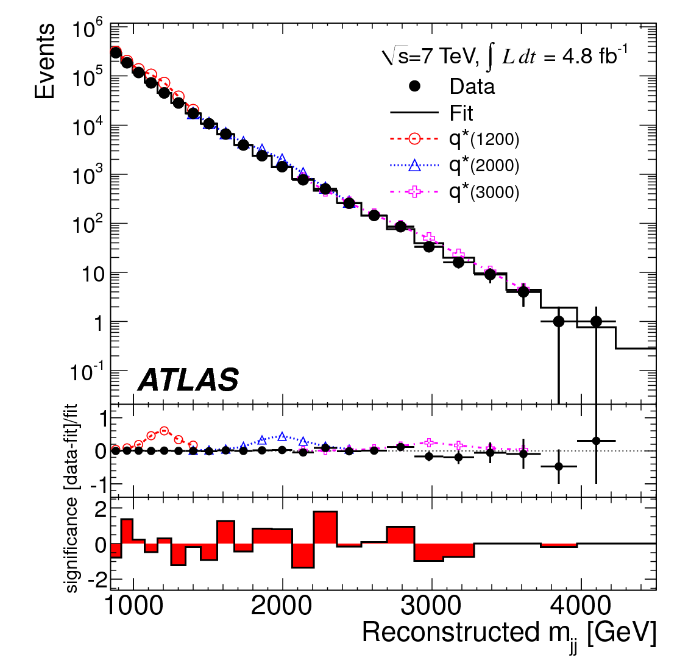
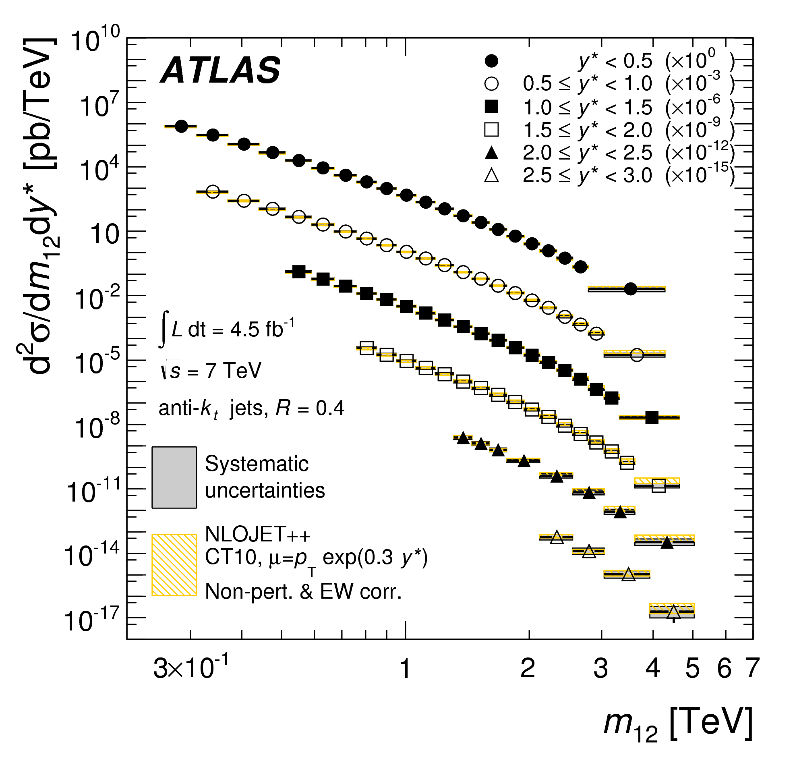
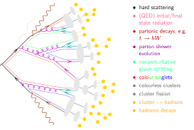
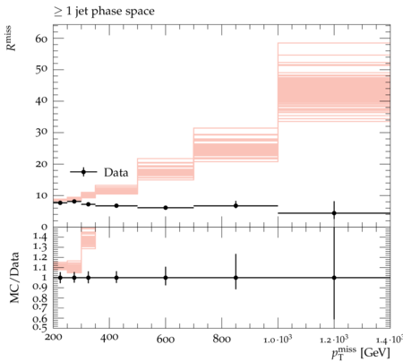
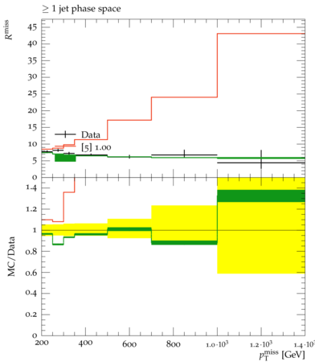
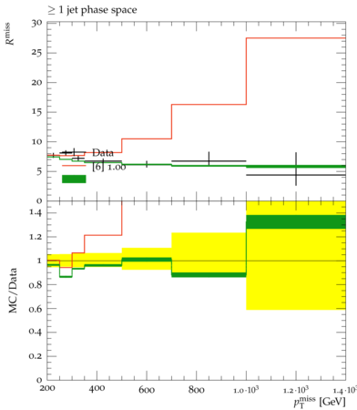
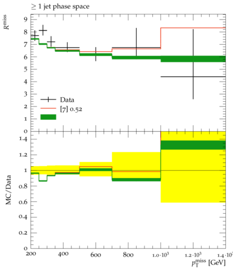
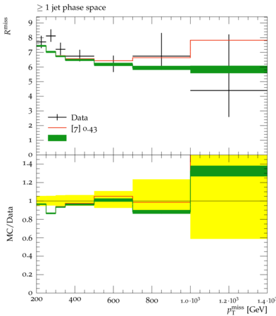

Now that we have a conceptual understanding of how we can go from a measurement to a meaningful
physics statement by using the power of likelihoods, let's contextualize this with the CONTUR tool.
CONTUR ([https://contur.hepforge.org/](https://contur.hepforge.org/), [1606.05296](https://arxiv.org/abs/1606.05296)) stands for **C**onstraints **O**n **N**ew **T**heories **U**sing **R**ivet
and aims at making as broad use of the wealth of measurements from the LHC, and really any other collider
experiment for that matter, by using the Rivet ([https://rivet.hepforge.org/](https://rivet.hepforge.org/))
analysis preservation paradigm.  In its current incarnation, doing so requires that certain approximations
are made which limit its power as compared to dedicated searches and it is further limited to only
those final states that are available as preserved [Rivet routines](https://rivet.hepforge.org/analyses/).  However,
as you will (hopefully) see, even with these limitation it can serve to be incredibly powerful in providing
broad constraints and help guide us to know which regions of parameter space are **not** interesting.

Doing this will require that we pass through two "broad" analysis stages, for which the executables
of each are available within the Docker image :
- Rivet Analysis : Implements selection and makes prediction of truth level spectra for our new BSM signal.
- Contur Analysis : Performs statistical analysis of data and predicted BSMN signal.

## Unfolded Spectra

The first somewhat unique aspect of the Contur approach to reinterpretations is that unlike
a conventional search at the LHC, Contur functions on "unfolded" spectra.  These are spectra
that are created typically for the purposes of performing measurements of pure SM processes.
A statistical procedure knows as unfolding ([https://arxiv.org/abs/1611.01927](1611.01927)) is performed which removes in
an average way the effects of finite detector resolution.  In some sense, though some purists
may cringe at this phrase, a "deconvolution" is performed.  The result of this is a spectra which
itself is "at truth level" and representative of the differential cross section measured in
that set of data for the process in question.  This can then be directly compared to a
theorists prediction of the fiducial (i.e. in the limited phase space accessible by the experiment)
cross section and this is typically done for an array of predictions.

Though the broad observation here, and the premise of working with such unfolded measurements
is that we have already presumed that the data agree with the SM prediction for that process ...
but only to within the uncertainties that result from propagating all those experimental
uncertainties through the unfolding procedure.  And it is within these uncertainties
that we assume BSM physics to perhaps lie.  With this in mind, we will be assuming that
**the entire cross section in data is itself background**!

## Truth Analysis

However, the great thing about working with unfolded spectra is that the effects of detector
simulation **need not be considered**! Yes, you read that right folks, we are going to do a search
for BSM physics at the LHC that is (to a degree) detector agnostic!  This is precisely due to
the fact that we have unfolded the spectra and that they are representative of a fiducial cross
section.  So if we want to compare a prediction to this observation, for example when making a
prediction for the amount of signal in a DM model that could be hiding within the uncertainties
previously discussed, we only need to perform the analysis at the "truth level" in which the
particles under question are stable hadrons.

This is precisely what [Rivet](https://rivet.hepforge.org/) does, and does well.  We will not go into the precise details
of how to design and implement a Rivet analysis, but the main point is that the methods in the
interface of Rivet only allow for "safe" reconstruction procedures.  For example, in Rivet, you
do not have access and the ability to readily use partons within the reconstruction of jets;
you only can construct hadron jets.  The reasoning here is that although a jet was "like a parton"
partons are not the things that enter our detector, but rather hadrons are.  So when we unfold
a measurement, we are only removing the effects of the resolution introduced by the detector,
resulting in a measurement that should only be compared to a prediction of the behavior of a set of
hadrons.  And working from the other direction means producing a theoretical prediction "at hadron
level".  This is precisely what Pythia does for us as an event generator.

## Running Rivet

Rivet takes as input the `HEPMC` file that you produced earlier, which contains the stable
hadron information.  This is contained within the `Events/run_XY` directory and you may
need to `gunzip` it if you haven't already :

~~~bash
cd Events/run_01
gunzip tag_1_pythia8_events.hepmc.gz
~~~

Next, go back to your main working `/contur` directory, above where MadGraph lies and run
the Rivet analysis routine for the ATLAS "unfolded monojet" measurement ([ATLAS_2017_I1609448](https://rivet.hepforge.org/analyses/ATLAS_2017_I1609448.html)).

~~~bash
rivet -a ATLAS_2017_I1609448 -o MyFirstRivetAnalysis.yoda MG5_aMC_v2_6_6/PROC_DMsimp_s_spin1_0/Events/run_01/tag_1_pythia8_events.hepmc
~~~

from which you should see a bunch of output that indicates you are performing the analysis

~~~
Event 100 (0:00:02 elapsed)
Event 200 (0:00:04 elapsed)
Event 300 (0:00:06 elapsed)
Event 400 (0:00:07 elapsed)
Event 500 (0:00:09 elapsed)
Event 600 (0:00:10 elapsed)
Event 700 (0:00:12 elapsed)
Event 800 (0:00:14 elapsed)
Event 900 (0:00:16 elapsed)
Event 1000 (0:00:18 elapsed)
Rivet.Analysis.Handler: INFO  Dumping intermediate results to RUN1.yoda.
Rivet.Analysis.Handler: INFO  Finalising analyses
Rivet.Analysis.Handler: INFO  Skipping finalize in periodic dump of ATLAS_2017_I1609448 as it is not declared reentrant.
~~~

This will produce what is called a "yoda file" - `MyFirstRivetAnalysis.yoda` - which contains the analyzed information
and functions essentially like a lightweight ROOT file.  If you are interested about why the Rivet authors chose to
*not* use ROOT, read the users manual, there is a section devoted to the history of this choice.

Let's start by inspecting this file by plotting the outcome of the analysis.  To do this, run the `rivet-mkhtml` command

~~~bash
rivet-mkhtml -o MyRivetPlots MyFirstRivetAnalysis.yoda
~~~

which will produce a directory called `MyRivetPlots`.  To be able to see the contents of this directory, which are
nicely formatted in an HTML page, move the directory itself to the `local` directory in the image which will
make it accessible in the "outside world" on your laptop.  Then navigate to it and open the `index.html` in whatever
way you do on your machine (on Mac OSX, you should be able to execute `open index.html`).  This will open a webpage
locally and you can explore its contents.  You should find only a few plots and they should be precisely the same
plots as those accompanying the published result for the unfolded spectra - [1707.03263](https://arxiv.org/abs/1707.03263).

The point here is that when designing an analysis, many investigations may have been done and come along with your
analysis.  However, in a Rivet analysis, only those spectra that have been unfolded to truth level are saved for inspection.
In this case, if you are using the default parameters in the model, particularly with a mediator mass of 1 TeV and the vector
coupling turned on, then you will notice that in general the prediction does not agree with the observed data.  That is because,
of course, the prediction is for a BSM process, and the data have been measured and shown to agree within the uncertainties
quoted on the datapoints.

> ## All The Lines!!!
>
> On these plots, you will notice (despite the lack of a clear and descriptive legend for everything), that there are data point
> which are the data for the unfolded spectra and then an ensemble of predictions from the input yoda file.  These predictions
> are individual predictions for all of the variations like PDF sets used and the renormalization and factorization scale chosen.
> They are theory uncertainties and are controlled via the `run_card.dat` we discussed earlier.
>
> Try to change the `run_card.dat` file to turn them off and perform a new run.  Did you notice if anything was faster? What do
> you see when you generate your Rivet HTML page?  (Hint : There should only be one theory curve.)
>
{: .challenge}

> ## Toggling the Mediator Mass
>
> To get some more practice with Rivet and MadGraph+Pythia, take a few minutes (it will take a while depending on the speed of
> your machine), to generate Rivet plots for the following parameter setting changes.
>
> - _Default__ : The mediator mass (`MY1`) is 1.0 TeV by default.  The dark matter mass (`MXd`) is set to 10 GeV.  The vector coupling (`gVXd`) is set to 1.0 and the axial-vector coupling (`gAXd`) is set to 0.0; it is a vector mediator.
> - Change the mediator mass to 1.5 TeV.
> - Change the mediator mass to 3.0 TeV and examine the same features.
> - With the mediator mass set _back to_ 1.0 TeV, change the model to be that of an **axial-vector** mediator as opposed to a vector mediator.
>
> With each change, after generting the Rivet plots, as yourself : How does the cross section change as compared to the default values?  Did the shape of the predicted spectra change?
>
> NOTE : The `rivet-mkhtml` executable can take as input multiple Rivet yoda files.  This make make your life in comparing things easier.  Explore this too.
>
{: .challenge}

## Running Contur

Ok, that was cool.  We made some spectra and we looked at them.  Perhaps you noticed that for certain parameter choices,
the predicted signal spectra was considerably different than the data, much more so than the size of the uncertianties
on the data itself.  In this case, it may be "obvious" that this parameter point is not viable.  However, in other cases it is
not as clear cut and we would like to be able to apply the statistical machinery described previously to this problem.  That ius
precisely what we can do with Contur.  From Contur, we will be able to produce, for a specific set of parameters, what the CL(s)
exclusion is for that point and specific signal strength of mu=1.  Well, actually 1-CL(s), but this is being pedantic and to appreciate the details of what we mean here, you
are referred to read [open-2000-205](open-2000-205).  But there are a few important assumptions and simplifications that
happen under the hood of which you should be cognisant :

- **[1] Data=Background** : Because the "search" reinterpretation is being performed on an unfolded spectra coming from a
measurement, by construction we have already concluded that there isn't any observable signal.  To this end, Contur
assumes that the unfolded spectrum of data **is** entirely background.  That is the background prediction.
- **[2] One Uncertainty** : In a normal search, and measurement for that sake, there are a large ensemble of systematic
uncertainties.  However, to keep life simple, all of these are boiled down into a single uncertainty on the yield
of the number of events in a given bin.  This is what you saw plotted as error bars on the data before.
- **[3] Biggest Deviation** : This is perhaps the biggest assumption and what somehow makes Contur exclusions conservative
but palatable (in Sam's opinion).  In a normal full "profile likelihood with CLs" statistical machinery, the full power
of the data is exploited by forming the likelihood as a product over exclusive signal regions, often called "bins".  However,
in Contur, a simplified approach is taken by treating each bin as an entirely separate measurement, from which the entire
statistical machinery is run.  Then, only the bin with the largest deviation (i.e. smallest CL(s) value) is taken as
representative of the CL(s) value for the interpretation.  In this way, Contur limits will always be less powerful than
their full blown counterparts.  Modifying this to make the limits more "complete" is a topic of ongoing developement and if you
want to help, then feel free to reach out to Jon Butterworth of David Yallup. I'm sure they would welcome more developers.

With these simplifying assumptions in mind and armed with an appreciation of "what we are looking for in terms of statistics"
(e.g. a CL = 1-CL(s) < 0.95 means excluded at 2 sigma), let's run Contur.  Start by choosing one of the yoda files that you
produced from the previous four runs in the above "Challenge" (yeah, you actually had to do that, so if you haven't then go
back and do it now).  For here, we will use the first run with the output file `MyFirstRivetAnalysis.yoda`.  This Rivet-formatted
file serves at the input to the generation of toys, and calculation of the CL(s) value for the parameters of that run
when executing :

~~~bash
contur -f MyFirstRivetAnalysis.yoda -o MyFirstRivetAnalysis-contur
~~~

this will print some debug information for the toy experiments and calculation of the CL values
and eventually produce some output like

~~~
WARNING - Negative CLs -0.943237, setting to zero. BSM+SM is in better agreement with data.
WARNING - Negative CLs -1.072024, setting to zero. BSM+SM is in better agreement with data.
WARNING - Negative CLs -0.012004, setting to zero. BSM+SM is in better agreement with data.
100%|##########| 1168/1168 [00:03<00:00, 295.03it/s]
Added yodafile with reported exclusion of: 1.0
Run Information
Contur is running in /contur on analysis objects in ['MyFirstRivetAnalysis.yoda']
Excluding Higgs to WW measurements
Building all available data correlations, combining bins where possible
Building default background model from data, ignoring optional theory predictions (excluding ratios)

Parameter values not known for this run.
Combined exclusion for these plots is 100.00 %

Writing output map to : ANALYSIS/contur.map
~~~

from which you can see that the exclusion for this particular parameter choices
(Reminder : The default values were mMed=1 TeV, mDM=10 GeV, and the coupling was a vector coupling with a value of 1.0.).
So the CL(s) value is effectively zero, meaning that this point in parameter space has been ruled out
to a very high degree of confidence.

From here, you can generate the debug plots for this run by executing

~~~bash
contur-mkhtml -d MyFirstRivetAnalysis-contur-plots MyFirstRivetAnalysis.yoda
~~~

which will produce a directory called `MyFirstRivetAnalysis-contur-plots` which is similar
in format to the previous Rivet directory you produced.  Move this to the `/contur/local` directory
to gain access on your local machine and inspect it.  You can now see not only the data as compared
to your signal, but also the published pure SM prediction.  And, unlike in the case of the Rivet plots
only the nominal signal, the one that is being probed and constrained, is shown.  By examining this
in comparison to the output CL exclusion level, do things vibe?  Do they make sense

> ## Probe the Space
>
> Previously, you produced a few additional runs which scanned the mediator mass in the vector
> model and also compared the vector and axial-vector couplings of this model.  Each of these is
> a unique point in parameter space for this model and we can begin mapping out the constraints
> provided by this MET+jets analysis.
>
> Do this by running contur and making the output plots for each scan point.  What do you observe?
> Are the results somehow consistent with what was observed in the published result? How do they differ?
>
> > ## Solution
> >
> > **Default** : mV=1 TeV, mDM=10 GeV, Vector3
> > ~~~
> > 100%|##########| 1168/1168 [00:03<00:00, 293.87it/s]
> > Added yodafile with reported exclusion of: 1.0
> > Run Information
> > Contur is running in /contur on analysis objects in ['run1_1000_vector.yoda']
> > Excluding Higgs to WW measurements
> > Building all available data correlations, combining bins where possible
> > Building default background model from data, ignoring optional theory predictions (excluding ratios)
> >
> > Parameter values not known for this run.
> > Combined exclusion for these plots is 100.00 %
> >
> > Writing output map to : ANALYSIS/contur.map
> > ~~~
> > 
> >
> >
> >
> > **Intermediate mV** : mV=1.5 TeV, mDM=10 GeV, Vector
> > ~~~
> > 100%|##########| 1168/1168 [00:04<00:00, 267.89it/s]
> > Added yodafile with reported exclusion of: 1.0
> > Run Information
> > Contur is running in /contur on analysis objects in ['run1_1500_vector.yoda']
> > Excluding Higgs to WW measurements
> > Building all available data correlations, combining bins where possible
> > Building default background model from data, ignoring optional theory predictions (excluding ratios)
> >
> > Parameter values not known for this run.
> > Combined exclusion for these plots is 100.00 %
> >
> > Writing output map to : ANALYSIS/contur.map
> > ~~~
> > 
> >
> >
> > **Large mV** : mV=3.0 TeV, mDM=10 GeV, Vector
> > ~~~
> > 100%|##########| 1168/1168 [00:07<00:00, 165.90it/s]
> > Added yodafile with reported exclusion of: 0.901622440643
> > Run Information
> > Contur is running in /contur on analysis objects in ['run1_3000_vector.yoda']
> > Excluding Higgs to WW measurements
> > Building all available data correlations, combining bins where possible
> > Building default background model from data, ignoring optional theory predictions (excluding ratios)
> >
> > Parameter values not known for this run.
> > Combined exclusion for these plots is 90.16 %
> >
> > Writing output map to : ANALYSIS/contur.map
> > ~~~
> > 
> >
> >
> > **Large mV and Axial-vector** : mV=3.0 TeV, mDM=10 GeV, Axial-Vector
> > ~~~
> > 100%|##########| 1168/1168 [00:05<00:00, 228.23it/s]
> > Added yodafile with reported exclusion of: 0.820975116911
> > Run Information
> > Contur is running in /contur on analysis objects in ['run1_3000_axialvector.yoda']
> > Excluding Higgs to WW measurements
> > Building all available data correlations, combining bins where possible
> > Building default background model from data, ignoring optional theory predictions (excluding ratios)
> >
> > Parameter values not known for this run.
> > Combined exclusion for these plots is 82.10 %
> >
> > Writing output map to : ANALYSIS/contur.map
> > ~~~
> > 
> >
> >
> >
> >
> >
> {: .solution}
{: .challenge}

## Plug and Chug

And there you have it, you now have at your disposal the tools by which to reinterpret the ATLAS
unfolded monojet search! We have only done it for a small set of points, but the rest is "just busywork".
As in the statistics section on "contouring", you now need to go forth and write scripts (or use
some of the baked-in-yet-not-super-well-documented functionality in Contur) to map out the parameter
space of interest and find the set of points that are excluded or which you fail to exclude.

Then, draw your contour.



